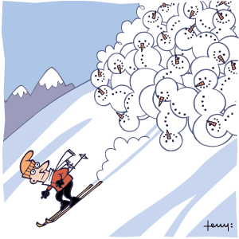

# They say it's risky, should I go ?

# Abstract
*A 150 word description of the project idea, goals, dataset used. What story you would like to tell and why? What's the motivation behind your project?*

**Risk 0 does not exist in alpinism and risk assessment remains an open question.** Statistical models have been developed to try to understand the risk. We do not claim that we can do better, but given that most of the accidents are due to bad people decisions, we are convinced that raising concern about the past mountaineering accidents can strongly improve alpinists' judgement in the future. The aim of this project is to gather meteorological and environmental data (weather condition, precipitations, snowpack, wind, temperatures…) along with avalanche cases and casualties. By leveraging interactive visualization means, we will provide the skiers ways to understand the conditions of previous cases and maybe hints that could have changed the outcome. We will focus on the Swiss and French Alps.

# Research questions
*A list of research questions you would like to address during the project.*

- What is the influence of weather conditions on past avalanche cases?
- How can we evaluate individuals' decisions when exposed to snow and avalanche risk report but still want to ride?
- What is the best way to visualize the 10 days of snow/weather conditions before an avalanche case? 
- Is there any unexpected correlation that current statistical models do not capture?
- Are avalanche accidents more lethal with a risk level of 3 than with a risk level of 5 ? Or just more frequent ? Is there a survival bias ?

# Dataset
*List the dataset(s) you want to use, and some ideas on how do you expect to get, manage, process and enrich it/them. Show us you've read the docs and some examples, and you've a clear idea on what to expect. Discuss data size and format if relevant.*

Two types of datasets are necessary :

*Avalanche dataset:*

- [data-avalanche.org](http://www.data-avalanche.org/listAvalanche/) **Alps (not only Switzerland)** is a dataset gathering avalanches information such as the location, the characteristic, the date, the type of snow and the danger of avalanches recorded in both France and Switzerland. Snow maps are available as well.

- The *Institute for Snow and Avalanche Research* ([slf](https://www.slf.ch/en/avalanches/destructive-avalanches-and-avalanche-accidents/avalanche-accidents-of-the-past-20-years.html)) provides tables and maps of the fatal avalanche accidents of the past 20 years in Switzerland.

*RISK ASSESSMENT OF OUR DATASET: In case Swiss avalanches data has a low temporal/spatial resolution to visualize patterns, we might pivot to the United States data. The [Colorado Avalanche Center](http://avalanche.state.co.us/accidents/us/) has detailed reports of every avalanche casualties in the last 8 years.*

*Meteorological dataset*

- Swiss data portal [meteo suisse](http://www.meteoschweiz.admin.ch/home/wetter/messwerte/messwerte-an-stationen.html?param=temperature) gathers meteorological and environmental data: weather condition, precipitations, snowpack, wind, temperatures in Switzerland.

- [historic meteo](http://www.historique-meteo.net/europe/suisse/)

[envidat](**http://www.envidat.ch/dataset?q=snow**)

# A list of internal milestones up until project milestone 2
Add here a sketch of your planning for the next project milestone.

- Data fetching: meteorological data, news parsing for past avalanche cases, investigate Rega or PGHM database (if public)
- ​

# Questions for TAa
*Add here some questions you have for us, in general or project-specific.*

We are aware that using external datasets is risky. But we are very motivated to achieve this analysis. We think that the plan we propose is feasible and fits well the project theme: "data science for social good". 

TODO risky to be out of TA dataset but we are risk aware (you say it's risky, there we go !)