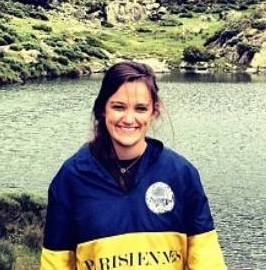

We are 3 students from [EPFL](https://www.epfl.ch) and this work is part of a group project for [Applied Data Analysis](https://dlab.epfl.ch/teaching/fall2017/cs401/) course taught by Professor Bob West.

 <!-- If Needed Left and Right Padding in 'md' and 'lg' screen means use container class -->
    

        

          
          
Brune Bastide

        

        

          
          
Jean-Baptiste Cordonnier

        

        

          
          
Arnaud Lesimple

        

    

### Data

We used the data from [SLF](https://www.slf.ch/de.html) (Swiss Institute for Snow and Avalanche Research). You can find some of the data here:

- [Avalanche accidents](https://www.slf.ch/en/avalanches/destructive-avalanches-and-avalanche-accidents/avalanche-accidents-of-the-past-20-years.html)
- [Reports archives](https://www.slf.ch/en/avalanche-bulletin-and-snow-situation/archive.html)

### Tools we used (and love)

Tools for "vanilla" Javascript:

- [D3.js](https://d3js.org/)
- [skeleton](http://getskeleton.com/)
- [beautiful-jekyll](https://github.com/daattali/beautiful-jekyll)
- [jQuery](https://jquery.com/)
- [Lodash](https://lodash.com/)
- [Leaflet.js](http://leafletjs.com/)
- [intro.js](https://introjs.com/)

Tools for [Python 3.6](https://www.python.org/):

- [JupyterLab](https://github.com/jupyterlab/jupyterlab)
- [Pillow](https://pillow.readthedocs.io/en/4.3.x/)
- [OpenCV](https://pypi.python.org/pypi/opencv-python)

### GitHub

You can find our [repository](https://github.com/swiss-avalanches/swiss-avalanches.github.io) on GitHub.

