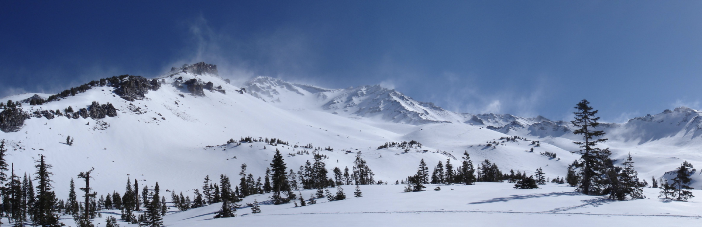
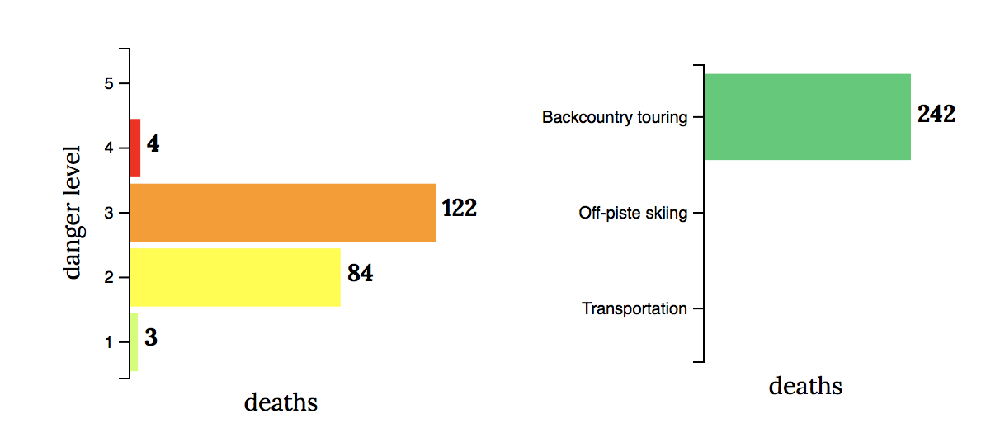
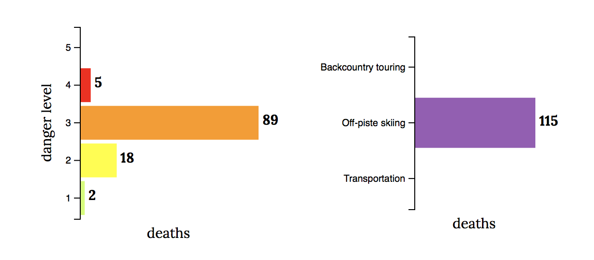
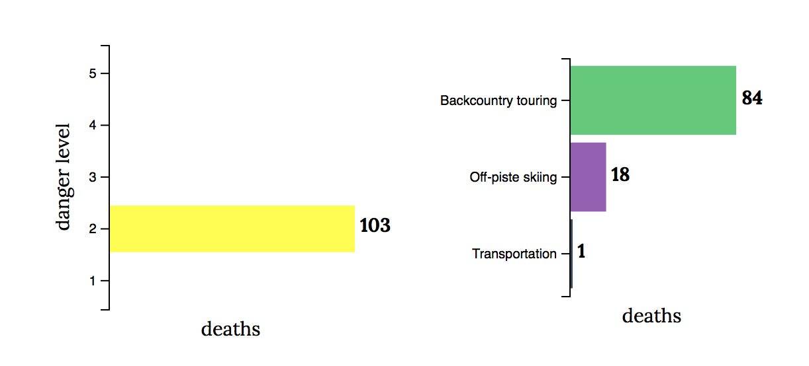
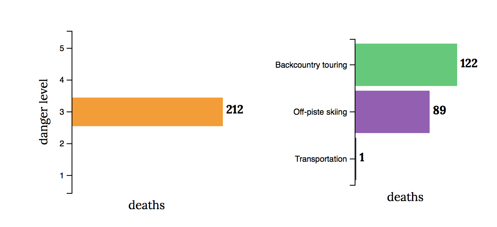
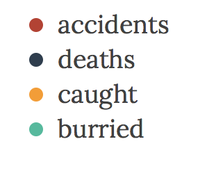
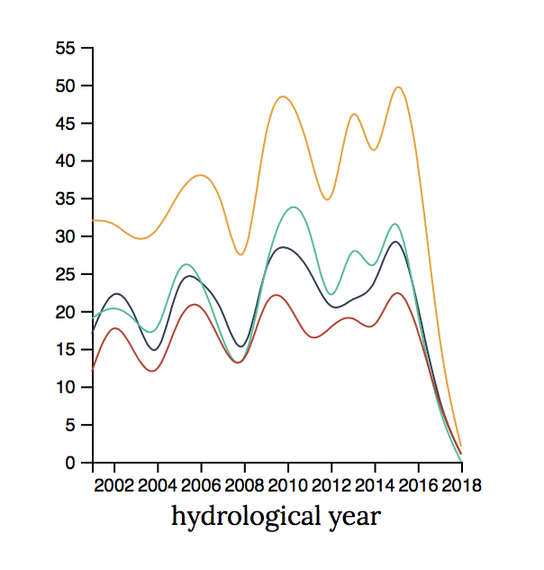

 *January 31st, 2015*

#### Piz Vilan, GR, Switzerland: Avalanche kills 5 tourists

**Eight** people were swept backcountry touring in an avalanche in Switzerland. **Five** of them did not survive. The announced **danger level** was 3. The death toll on that day was the worst in five years. 

Up to 1.2 metres of snow has fallen in the region in recent days, and authorities had made repeated warnings of continuing avalanche dangers in many parts of the Swiss Alps and the Jura Mountains.

This avalanche went down a mountain's eastern flank at an elevation of 2340 meters. The group of skiers caught was **backcountry touring**. 

There was no immediate word on what triggered the avalanche. 

- *What is the evolution of such accidents over time?*
- *Is the exposure of the location of the accident a main cause?*
- *Are some mountain activities riskier than others?*
- *Is the danger level a good indicator of risk?*

We will try to answer these questions through an interactive visualisation of the last 15 years of avalanche cases.

We know from press release that the group was caught skiing at a level 3 of danger. The higher the danger level is, the higher are the odds for an avalanche to be triggered. TODO Which mountain activity is the most deadly? 

We can observe that the most deadly levels are 2 and 3. An explanation to that phenomenon is that low levels of danger (1 TODO DOT) is often synonym of not much snow and a high level (4 or 5) repels skiers to expose themselves to hazard. These are outlier situations that will be excluded from our further analysis.

One can notice from the previous facts that the group caught was *backcountry touring*, but accidents can also happen *off-piste skiing*. 

CEST FAUX NUL TODO We observe that in both danger levels 2 and 3, the number of deaths is higher whilst backcountry touring than off-piste skiing. Once again, decision-making from the skiers has a large influence of their destiny.

The avalanche cases that make it to the front page of the news mostly report deaths, one might ask about the accidents that are not fatal. 

Petite conclusion

You will be able to play with the data under [**EXPLORE**](../explore/).

