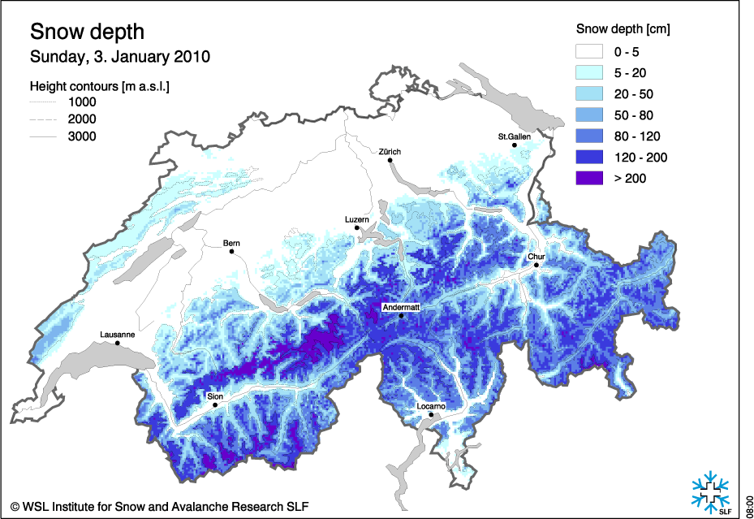
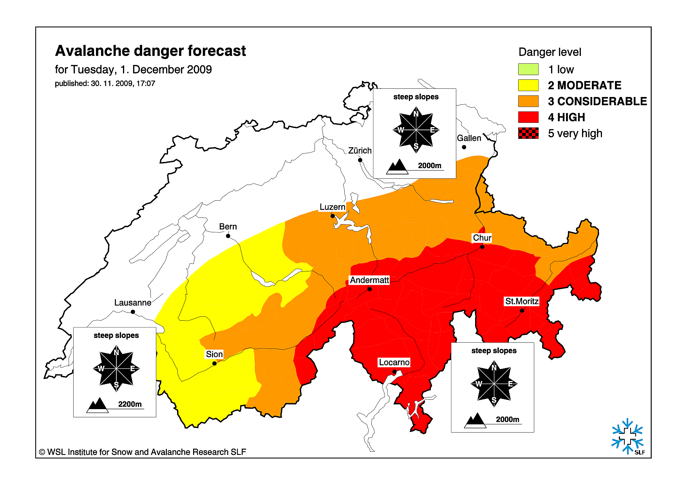
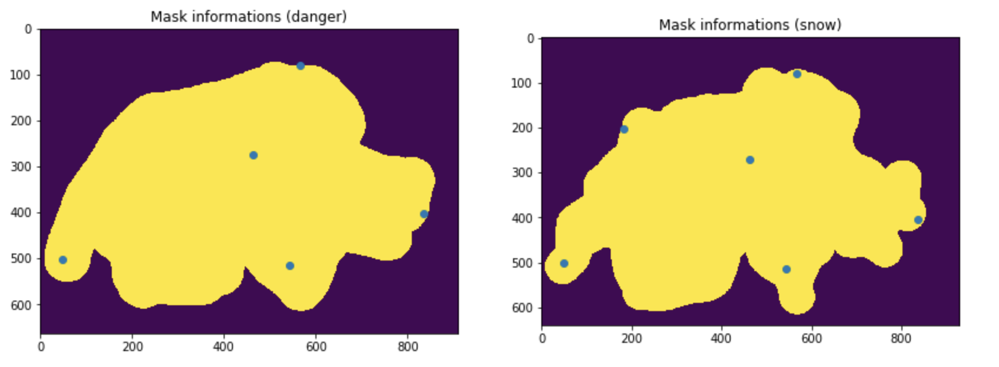
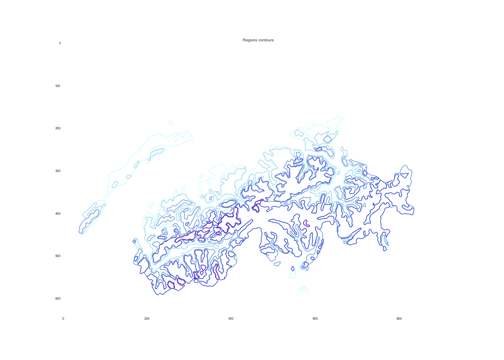
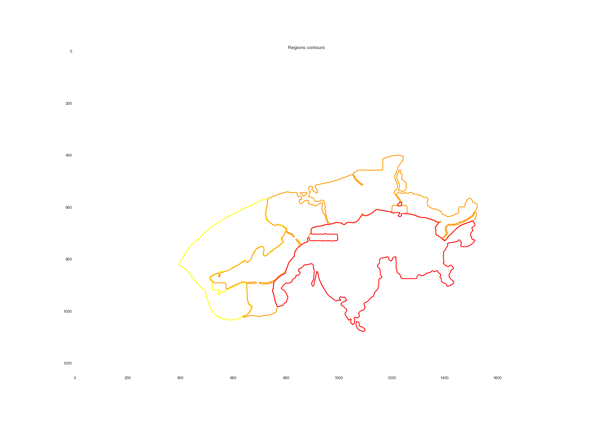
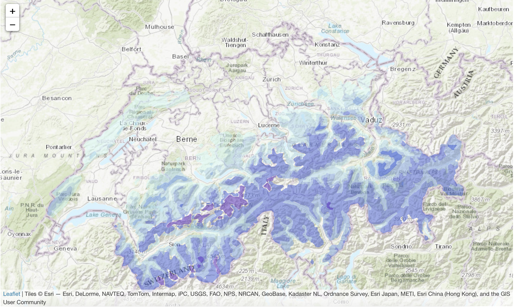

An important part of this project was data extraction. The [Swiss Institude of Snow and Avalanches](https://www.slf.ch/) kept a very good record of all the published avalanche/weather bulletins. Most of it were shared by paper 15 years ago and we decided to digitalize it make our analysis/vizualisation possible. The following article goes through our extraction procedure. You can browse through the results in [EXPLORE](https://swiss-avalanches.github.io/explore/).

## 1. Data scraping

Our dataset consists of information retrieved from [SLF archives](https://www.slf.ch/en/avalanche-bulletin-and-snow-situation/archive.html). We asked the managers to access their database but they couldn't help us. No problem, we scraped hard core for one night.

Several filters were used to select the folders we wished to extract: :

- **language:** files are often duplicated for the 4 languages (de, fr, it, en). When it is the case we download only one set in the following order of preference: en, fr, de. German is the default (always present).
- **too specific:** some files are not interesting for now (too specific or too regional). We don't download the snow profiles and the regional snow report,
- **color or black and white:** maps are available in color and in black and white. Colors are easier than textures for computer vision algorithms, so we drop the black and white maps.

Now we can use the python script `../tools/download.py` to fetch the ~30'000 files in the directory structure.

```bash
python3 tools/download.py data/file_to_download. ./data/slf --prefix https://www.slf.ch/fileadmin/user_upload/import/lwdarchiv/public/ --nproc 4
```

We got approximately 5GB of data that we store on a S3 bucket `s3://ada-avalanches`. Let us know if you want to have access. It has the same hierarchy as [SLF archives](https://www.slf.ch/en/avalanche-bulletin-and-snow-situation/archive.html)

## 2. Map extraction

The most challenging part of the data extraction was retreiving the necessary informations from images provided by the website [SLF archives](https://www.slf.ch/en/avalanche-bulletin-and-snow-situation/archive.html). Here are some sample maps, we had more that 10'000 of them, so we had to automatize the process ;)

<div class="container-fluid"> <!-- If Needed Left and Right Padding in 'md' and 'lg' screen means use container class -->
    <div class="row">
        <div class="col-xs-6 col-sm-6 col-md-6 col-lg-6">
          
          <div class="legend" align="center">Raw snow map</div>
        </div>
        <div class="col-xs-6 col-sm-6 col-md-6 col-lg-6">
          
          <div class="legend" align="center">Raw danger map</div>
        </div>
    </div>
</div>

We developped a handful of methods to extracts the snow and danger regions from the color maps.

- **grey removal**: looking at standard deviation of color channels for each pixel, we could threshold the greys and remove them from the original image,
- **color projection**: due to the noise in the image or minor differences in the color tones, we had to project each pixel's color to the closest color in the reference key (with euclidean distance).
- **mask clipping**: many images had different sizes or were centered differently. We created binary masks to remove the legend, the title and sometimes extra logos or noise.


<div class="container-fluid"> <!-- If Needed Left and Right Padding in 'md' and 'lg' screen means use container class -->
    <div class="row">
        <div class="col-xs-12 col-sm-12 col-md-12 col-lg-12">
            
            <div class="legend" align="center">Clipping masks, blue dots are Swiss landmarks used for pixel to geolocation projection</div>
        </div>
    </div>
</div>

- **smoothing**: to remove small imperfections or noisy color projections, we used a median filter in order to get smoother regions and ease the task of contour detection.

<div class="container-fluid"> <!-- If Needed Left and Right Padding in 'md' and 'lg' screen means use container class -->
    <div class="row">
        <div class="col-xs-6 col-sm-6 col-md-6 col-lg-6">
          
          <div class="legend" align="center">Example of extracted snow countours</div>
        </div>
        <div class="col-xs-6 col-sm-6 col-md-6 col-lg-6">
          
          <div class="legend" align="center">Example of extracted danger countours</div>
        </div>
    </div>
</div>
<div class="spacing" style="height: 15px;"></div>

- **region detection**: using color detection we extracted the contour of each region.
- **pixel to geo location projection**: once we had contours of the regions in the image (by pixels) we had to transform those into geolocated regions. To do so, we learned a mapping from pixel to geolocations. We took 6 points  of references on the image and on Google maps (blue dots above). Note that 3 would have been enough to constraint the problem, but with least square solver we could average out our small mistakes at picking pixel location of the landmarks.
- **GeoJSON creation and website**: to visualize the regions, we transformed them into GeoJSON, smoothed these polygons and displayed them as interactive map overlays.

<div class="container-fluid"> <!-- If Needed Left and Right Padding in 'md' and 'lg' screen means use container class -->
    <div class="row">
        <div class="col-xs-12 col-sm-12 col-md-12 col-lg-12">
            
            <div class="legend" align="center">Example of extracted snow regions overlay</div>
        </div>
    </div>
</div>

By running the python scripts `../tools/map_extractor.py` and `../tools/map_extractor_adapted2snow.py` we could automatize the extraction of maps, which ran for more than 30 hours!

`python3 tools/map_extractor.py data/slf/ data/map-masks/ json-maps/`

More than 10'000 maps were extracted and converted into JSON files which we further used for analysis and visualisation. Each of the JSON files has several features, in both danger and snow related maps we assigned a date and a URL so that the user can compare the results obtained with the raw data.

## 3. Avalanches accidents

The avalanche accidents were downloaded from the [SLF avalanche accidents](https://www.slf.ch/en/avalanches/destructive-avalanches-and-avalanche-accidents/avalanche-accidents-of-the-past-20-years.html) website with precise coordinates for each accident. From this dataset, we obtained 350 accidents that happenened over the last 20 years in Switzerland. For each one of them, we have the date, the location, the danger level that was announced and the number of people that were caught, buried and killed.  We built a map showing accidents depending on the risk level to visualise the data points which you can find in `notebooks/accidents.ipynb`. You will find the result of that mapping under [EXPLORE](../explore/).
