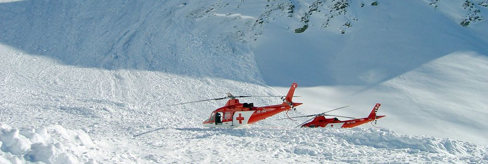

Risk zero does not exist in alpinism. Statistical models have been developed to assess this risk but they do not prevent tragedies. We do not claim that we can do better, but given that most of the accidents are due to bad people decisions, we are convinced that raising concern about the past mountaineering accidents can strongly improve alpinists' judgement in the future. The aim of this project is to gather meteorological and environmental data (weather condition, precipitations, snowpack, slopes, exposures...) along with avalanche cases and casualties. By leveraging means of interactive visualization, we provide the skiers ways to understand the conditions of previous cases and maybe hints that could have changed the outcome. Our observational study focuses on the Swiss Alps.

You can go through

1. a [data story](datastory) on risk assessment statitistics,
2. a summary of our work on [data extraction](extraction),
3. our [interactive visualization tool](explore) of 15 years of avalanche cases.

Enjoy!
